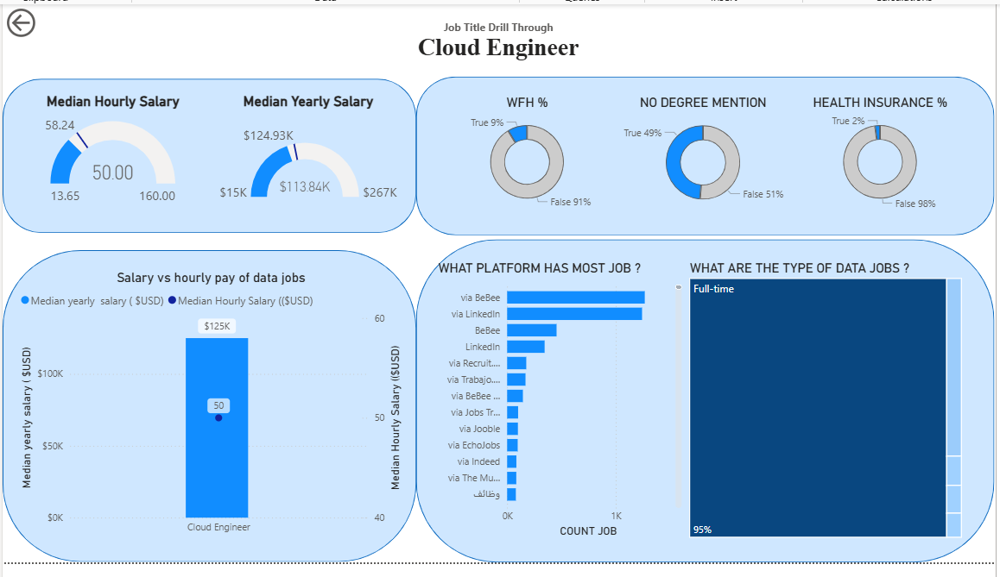
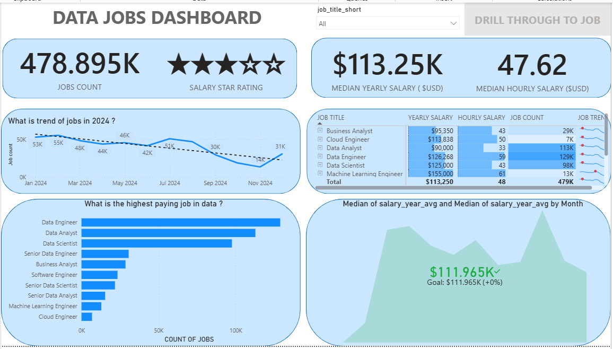

# 📊 Data Jobs Market Analysis - Version 1.0 (Foundation & EDA)

## 🚀 Project Overview
This foundational project focuses on exploring the data job market landscape in 2024. The primary goal is to empower job seekers by identifying top-paying roles, essential skills, and global hiring trends, laying the groundwork for deeper analysis.

## ❓ Research Questions
This project is designed to answer the following specific business questions:
1. Which data roles offer the highest compensation?
2. How do hiring trends fluctuate across different months?
3. What is the degree requirement ratio between Senior and Junior positions?
4. How are job opportunities distributed across various countries and job boards?

## 🛠 Skills Showcased
- **Data Engineering (ETL):** Leveraged **Power Query** to clean raw data, standardize date formats, and handle missing values (Nulls).
- **Advanced DAX:** Created measures to calculate the **Median Salary** rather than the Average, preventing data skewness caused by extreme outliers.
- **Data Visualization:** Designed an interactive dashboard utilizing an intuitive navigation system with Buttons and Bookmarks.
- **Geospatial Analysis:** Utilized Map visuals to illustrate global job density and distribution.

## 📊 Dashboard Overview
### 1. Market Overview Page

*This page provides a macro-level view of job volumes, median salaries, and temporal hiring trends.*

### 2. Role Drill-through Page

*Enables users to drill down into specific roles (e.g., Data Engineer) to view detailed skill requirements and compensation breakdowns.*

## 💡 Key Insights
- **Salary:** Senior Data Scientist positions command the highest median salary (approximately **$155K**).
- **Degree Requirements:** Over **90%** of Data Scientist roles require a formal degree, whereas Data Engineering roles show a slightly lower strictness regarding degrees.
- **Platforms:** LinkedIn remains the most abundant and dominant job board for the data industry.

### 🎯 Actionable Takeaways for Job Seekers
- **For rapid employment:** Focus on mastering the core trio (**SQL, Excel, Power BI/Tableau**) and target Data Analyst positions.
- **For long-term income maximization:** Begin acquiring skills in **Python** and Cloud computing (**AWS/Azure**) to gradually transition toward Data Engineering roles.

---

  
🇻🇳 <strong>Bấm vào đây để đọc phiên bản Tiếng Việt</strong>

## 🚀 Tổng quan dự án
Dự án này tập trung vào việc khám phá thị trường việc làm ngành dữ liệu trong năm 2024. Mục tiêu là giúp các ứng viên (Job Seekers) xác định được những vị trí có thu nhập cao nhất, các kỹ năng cần thiết và xu hướng tuyển dụng toàn cầu.

## ❓ Câu hỏi nghiên cứu
Dự án này giải quyết các bài toán cụ thể sau:
1. Những công việc nào có mức lương cao nhất?
2. Xu hướng tuyển dụng thay đổi như thế nào qua các tháng?
3. Tỷ lệ yêu cầu bằng cấp đối với các vị trí Senior và Junior là bao nhiêu?
4. Phân bổ việc làm theo quốc gia và nền tảng tuyển dụng.

## 🛠 Kỹ năng đã áp dụng (Skills Showcased)
- **Xử lý dữ liệu (ETL):** Sử dụng Power Query để dọn dẹp dữ liệu, chuẩn hóa định dạng ngày tháng và xử lý giá trị trống (Null).
- **Phân tích nâng cao (DAX):** Tạo các Measure để tính toán mức lương trung bình (Median Salary) thay vì dùng trung bình cộng (Average) để tránh sai số do ngoại lai.
- **Trực quan hóa dữ liệu:** Thiết kế Dashboard tương tác với hệ thống điều hướng bằng Button và Bookmark.
- **Phân tích không gian (Geospatial Analysis):** Sử dụng Map visuals để hiển thị mật độ việc làm toàn cầu.

## 📊 Dashboard Overview
### 1. Trang Tổng quan Thị trường (Market View)

*Trang này cung cấp cái nhìn tổng thể về số lượng job, mức lương và xu hướng theo thời gian.*

### 2. Trang Chi tiết Chức danh (Drill-through Page)

*Cho phép người dùng đi sâu vào từng vị trí cụ thể (ví dụ: Data Engineer) để xem chi tiết kỹ năng và chế độ đãi ngộ.*

## 💡 Kết luận (Insights)
- **Mức lương:** Các vị trí Senior Data Scientist có mức lương Median cao nhất (khoảng $155K).
- **Yêu cầu bằng cấp:** Hơn 90% các vị trí Data Scientist yêu cầu bằng cấp, trong khi Data Engineer có tỷ lệ thấp hơn một chút.
- **Nền tảng:** LinkedIn vẫn là nguồn dữ liệu việc làm phong phú nhất cho ngành Data.

### 🎯 Khuyến nghị hành động (Actionable Takeaways cho Job Seekers)
- **Nếu mục tiêu là tìm việc nhanh:** Hãy tập trung làm chủ bộ 3 công cụ cốt lõi (SQL, Excel, Power BI/Tableau) và apply vào các vị trí Data Analyst.
- **Nếu mục tiêu là tối đa hóa thu nhập dài hạn:** Hãy bắt đầu học thêm về Python, Cloud (AWS/Azure) để từ từ dịch chuyển định hướng sang Data Engineer.

