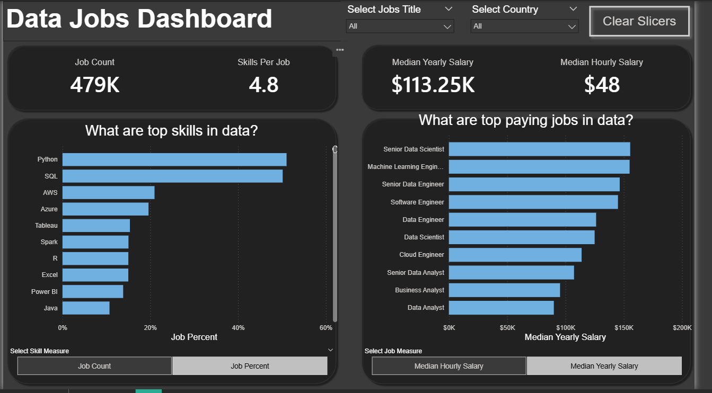

# 📊 Data Jobs Market Analysis Dashboard (Version 2.0)

## 📝 Project Overview
This project is an Interactive Dashboard built on Power BI to deeply analyze the job market in the Data domain (Data Analytics, Data Science, Data Engineering, etc.). 
The primary objective is to provide a comprehensive visual perspective on top skill trends, median salaries across various roles, and overall market metrics, thereby empowering candidates and recruiters to make data-driven decisions.

## 🖼 Dashboard Snapshot

## 🚀 Key Features
- **Dynamic Field Parameters:** Optimized UI/UX by allowing users to dynamically switch metrics (e.g., from *Median Hourly Salary* to *Median Yearly Salary*) or view skills by *Job Count* vs. *Job Percent* within the same visual space without cluttering the dashboard.
- **Interactive Filtering:** Integrated a flexible slicer system (Job Title, Country) along with a convenient `Clear Slicers` bookmark button.
- **Dark Theme UI:** Modern dark mode design applying the Z-Pattern visual hierarchy to highlight the most critical KPIs at the top left.

## 🛠 Tools & Techniques
- **Power Query:** Data wrangling, handling path errors, standardizing formats, and feature extraction.
- **Data Modeling:** Designed a standard **Star Schema** (Fact & Dimension tables) to optimize query performance and data relationships.
- **DAX (Data Analysis Expressions):**
  - Developed a robust system of Explicit Measures.
  - Utilized advanced filter context modifiers (`CALCULATE`, `ALL`) to compute complex percentages and overall benchmarks.
- **Data Visualization:** Interactive dashboard design on **Power BI Desktop**.

## 💡 Key Insights
Based on a dataset of **479K** job postings, the core findings are as follows:

1. **Market Overview:** - The median yearly salary across the data industry stands at **$113.25K**.
   - On average, a single data job posting requires candidates to possess **4.8** different skills.
2. **Top Demand Skills:** - **Python** and **SQL** strictly dominate the market, appearing in approximately 50% of all data job postings.
   - Cloud computing platforms like **AWS** and **Azure** closely follow, indicating a strong enterprise shift toward cloud infrastructure.
3. **Top Paying Jobs:** - Advanced roles such as **Senior Data Scientist** and **Machine Learning Engineer** lead the compensation board, with median salaries approaching or exceeding **$150K/year**.
   - Core infrastructure roles (**Data Engineer/Software Engineer**) are generally valued higher than **Data Analyst/Business Analyst** roles. However, Data Analysts maintain a solid median salary range of $90K - $100K/year.

## 📂 Repository Structure
- `/DataJob_ver2`
  - `/image`: Contains dashboard screenshots (`imagedashboard.png`).
  - `Data_Jobs_Dashboard.pbix`: The core Power BI file containing the Data Model, DAX, and Report.
  - `README.md`: Project documentation.

---

  
🇻🇳 <strong>Bấm vào đây để đọc phiên bản Tiếng Việt</strong>

## 📝 Tổng quan dự án (Project Overview)
Dự án này là một Interactive Dashboard được xây dựng trên Power BI nhằm phân tích sâu thị trường việc làm trong lĩnh vực Dữ liệu. 
Mục tiêu của dự án là cung cấp góc nhìn trực quan về xu hướng kỹ năng, mức lương trung bình cho từng vị trí, và các chỉ số tổng quan của thị trường để hỗ trợ ứng viên và nhà tuyển dụng đưa ra quyết định dựa trên dữ liệu.
## 🖼 Dashboard Snapshot

## 🚀 Các tính năng nổi bật (Key Features)
- **Dynamic Field Parameters:** Tối ưu hóa UI/UX bằng cách cho phép người dùng tự do chuyển đổi thước đo (Ví dụ: Chuyển đổi linh hoạt giữa *Median Hourly Salary* và *Median Yearly Salary*) trên cùng một không gian biểu đồ.
- **Interactive Filtering:** Tích hợp hệ thống Slicers linh hoạt (Job Title, Country) cùng nút `Clear Slicers` tiện lợi.
- **Dark Theme UI:** Thiết kế giao diện theo phong cách tối hiện đại, áp dụng nguyên tắc thị giác chữ Z (Z-Pattern) giúp làm nổi bật các chỉ số KPIs quan trọng nhất ở góc trên.

## 🛠 Công cụ & Kỹ thuật sử dụng (Tools & Techniques)
- **Power Query:** Làm sạch dữ liệu thô, xử lý lỗi định dạng, và trích xuất đặc trưng.
- **Data Modeling:** Xây dựng mô hình dữ liệu chuẩn **Star Schema** để tối ưu hiệu suất truy vấn.
- **DAX (Data Analysis Expressions):**
  - Xây dựng hệ thống Explicit Measures.
  - Sử dụng các hàm điều hướng Filter Context nâng cao (`CALCULATE`, `ALL`) để tính toán tỷ lệ phần trăm phức tạp.

## 💡 Key Insights (Kết quả Phân tích từ Dữ liệu)
Dựa trên tập dữ liệu gồm **479K** tin tuyển dụng, dưới đây là những thông tin cốt lõi rút ra được:

1. **Tổng quan thị trường:** - Mức lương trung bình năm của ngành dữ liệu đạt mức **$113.25K**.
   - Trung bình mỗi tin tuyển dụng yêu cầu ứng viên phải đáp ứng khoảng **4.8** kỹ năng.
2. **Kỹ năng "Vàng":** - **Python** và **SQL** là hai kỹ năng thống trị tuyệt đối, xuất hiện trong khoảng 50% tổng số tin tuyển dụng ngành dữ liệu.
   - Các nền tảng Điện toán đám mây như **AWS** và **Azure** theo sát ở vị trí tiếp theo.
3. **Mức lương theo vị trí:** - Các vị trí cấp cao như **Senior Data Scientist** và **Machine Learning Engineer** dẫn đầu bảng lương với mức xấp xỉ hoặc vượt ngưỡng **$150K/năm**.
   - Vai trò cốt lõi về hạ tầng như **Data Engineer/Software Engineer** có mức định giá cao hơn so với **Data Analyst/Business Analyst**. Tuy nhiên, Data Analyst vẫn giữ mức lương trung bình ổn định ở khoảng $90K - $100K/năm.
  

